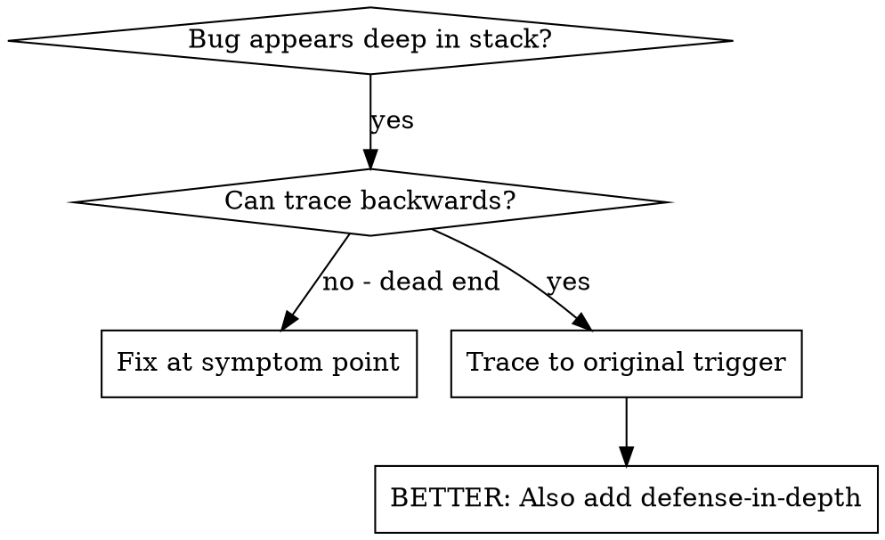
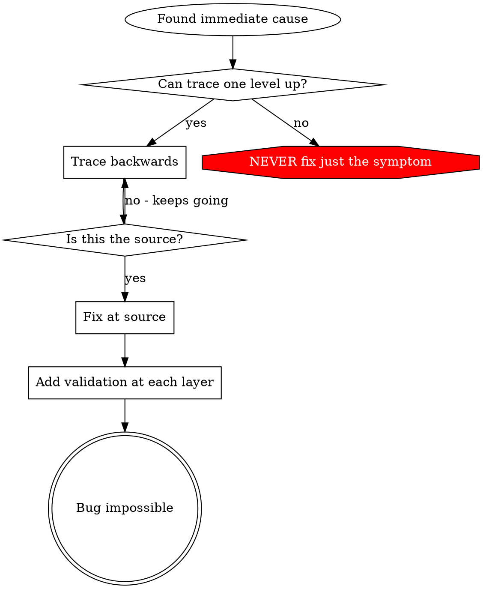

# Root Cause Tracing

## Overview

Bugs often manifest deep in the call stack (HardFault in SPI driver, wrong register configuration, invalid pointer dereference). Your instinct is to fix where the error appears, but that's treating a symptom.

**Core principle:** Trace backward through the call chain until you find the original trigger, then fix at the source.

## When to Use



**Use when:**
- Error happens deep in execution (not at entry point)
- Debugger stack trace shows long call chain
- Unclear where invalid data originated
- Need to find which test/initialization triggers the problem

## The Tracing Process

### 1. Observe the Symptom
```
HardFault at 0x08001234: Invalid memory access in SPI_Transfer()
```

### 2. Find Immediate Cause
**What code directly causes this?**
```c
status = SPI_Transfer(spi_handle, tx_buf, rx_buf, len);
// spi_handle is NULL → dereference causes HardFault
```

### 3. Ask: What Called This?
```c
SPI_Transfer(spi_handle, ...)
  → called by sensor_read_data()
  → called by sensor_init()
  → called by init_peripherals()
  → called by main()
```

### 4. Keep Tracing Up
**What value was passed?**
- `spi_handle = NULL` (not initialized!)
- `sensor_init()` called before `spi_init()`
- Initialization order is wrong

### 5. Find Original Trigger
**Where did NULL come from?**
```c
static SPI_Handle_t* g_spi_handle = NULL;  // Never assigned

void sensor_init(void) {
    sensor_read_data(g_spi_handle);  // Used before spi_init()!
}
```

## Adding Instrumentation

When you can't trace manually, add debug output:

```c
// Before the problematic operation
int SPI_Transfer(SPI_Handle_t* handle, uint8_t* tx, uint8_t* rx, size_t len)
{
    printf("DEBUG SPI_Transfer: handle=%p, len=%zu, caller=%p\n",
           (void*)handle, len, __builtin_return_address(0));

    if (handle == NULL) {
        printf("ERROR: NULL handle! Stack:\n");
        print_backtrace();  // Platform-specific
        return -1;
    }

    // ... actual transfer
}
```

**TRACE macro example:**
```c
#define TRACE_FUNC() printf("[TRACE] %s called from %p\n", \
                            __func__, __builtin_return_address(0))
```

**Critical:** Use UART printf or semihosting for debug output (not buffered logging that may not flush before crash).

**Capture and analyze:**
- Use debugger to set breakpoints before the fault
- Examine call stack when breakpoint hits
- Look for pattern: same caller? same parameter?

## Finding Which Test Causes Pollution

If something fails during test suite but you don't know which test:

**Debugger approach:**
1. Set watchpoint on corrupted memory location
2. Run tests until watchpoint triggers
3. Examine call stack to find polluter

**Isolation approach:**
```c
// Run tests in isolation to find polluter
void find_polluting_test(void)
{
    for (int i = 0; i < NUM_TESTS; i++) {
        reset_system_state();
        run_single_test(i);
        if (check_for_pollution()) {
            printf("Test %d caused pollution\n", i);
            return;
        }
    }
}
```

**Binary search:** Run first half of tests, check for pollution; narrow down.

## Real Example: Uninitialized SPI Handle

**Symptom:** HardFault during sensor read, only happens after power cycle

**Trace chain:**
1. `SPI_Transfer()` dereferences NULL handle → HardFault
2. `sensor_read_data()` called with `g_spi_handle`
3. `sensor_init()` called from `init_peripherals()`
4. `init_peripherals()` calls `sensor_init()` BEFORE `spi_init()`
5. `g_spi_handle` is NULL because `spi_init()` hasn't run yet

**Root cause:** Wrong initialization order in `init_peripherals()`

**Fix:** Reordered initialization so `spi_init()` runs before `sensor_init()`

**Also added defense-in-depth:**
- Layer 1: `SPI_Transfer()` checks for NULL handle
- Layer 2: `sensor_init()` validates SPI is ready
- Layer 3: Build-time static assert for init order dependencies
- Layer 4: Debug build logs all peripheral init calls with caller address

## Key Principle



**NEVER fix just where the error appears.** Trace back to find the original trigger.

## Instrumentation Tips

**Use UART/semihosting:** `printf()` to debug console, not buffered logging
**Before crash:** Log before the dangerous operation, not after it fails
**Include context:** Register values, pointer addresses, peripheral state
**Capture caller:** `__builtin_return_address(0)` shows who called this function
**Watchpoints:** Use debugger data breakpoints to catch memory corruption
**Trace buffers:** Circular buffer of recent function calls survives crashes

## Embedded-Specific Techniques

**For HardFaults:**
```c
void HardFault_Handler(void)
{
    uint32_t* sp = (uint32_t*)__get_MSP();
    printf("HardFault! PC=0x%08lx LR=0x%08lx\n", sp[6], sp[5]);
    while(1);
}
```

**For ISR issues:** Log ISR entry/exit with timestamps to find race conditions.

**For DMA corruption:** Use MPU to guard memory regions during debug.

**For init order bugs:** Static initialization checklist with runtime validation.
