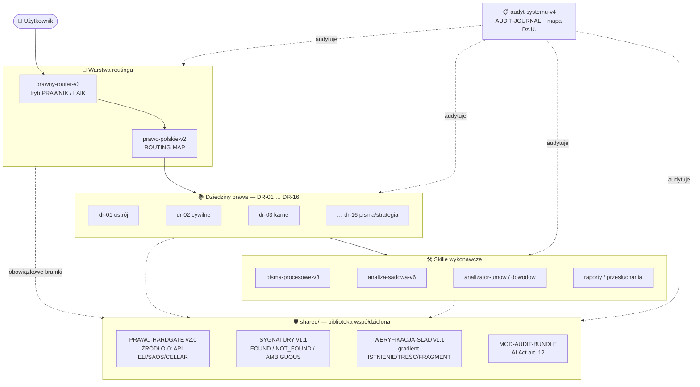

<div align="center">

# ⚖️ Lex Machina

**Modułowy system skilli prawniczych AI dla prawa polskiego — z twardymi bramkami antyhalucynacyjnymi**

[](LICENSE)
[](#-wersjonowanie)
[](#-wersjonowanie)
[](#-katalog-skilli)
[](https://claude.ai)
[](#)

*System pokrywa 16 dziedzin prawa polskiego i unijnego: od routingu sprawy, przez analizę
dowodów i strategię procesową, po generowanie pism — z obowiązkową weryfikacją online
każdego przepisu i każdej sygnatury.*

[Szybki start](#-szybki-start) •
[Architektura](#%EF%B8%8F-architektura) •
[Katalog skilli](#-katalog-skilli) •
[Mechanizmy weryfikacji](#%EF%B8%8F-mechanizmy-antyhalucynacyjne) •
[Instalacja](#-instalacja) •
[Zadania cykliczne (Cowork)](#zadania-cykliczne-scheduled-tasks-w-cowork) •
[Zastrzeżenia](#%EF%B8%8F-zastrzeżenia-prawne)

</div>

---

## 🎯 Czym jest Lex Machina

Lex Machina to zestaw **33 skilli** (Claude AI Skills) tworzących kompletny warsztat pracy
z polskim prawem:

| | |
|---|---|
| 🧭 **Orkiestracja** | router spraw z trybami **PRAWNIK / LAIK**, macierz aktywacji, checkpointy jakości |
| 📚 **Wiedza dziedzinowa** | 16 modułów DR — każda dziedzina prawa PL/UE, jeden moduł = jeden akt prawny |
| 🛠️ **Narzędzia wykonawcze** | pisma procesowe, analiza umów i dowodów, przesłuchania świadków, chronologia, raporty |
| 🛡️ **Antyhalucynacja** | HARD GATE: zakaz cytowania prawa z pamięci, deterministyczne API, gradient weryfikacji cytatu |
| 📋 **Governance** | dziennik audytów, mapa Dz.U., paczka audytowa AI Act art. 12, polityka deduplikacji |

> **Zasada naczelna:** *brak numeru artykułu jest lepszy niż błędny numer artykułu;
> brak sygnatury jest lepszy niż sygnatura nieweryfikowana lub fałszywa.*

---

## 🚀 Szybki start

1. Pobierz repozytorium (`Code → Download ZIP` lub `git clone`)
2. Wgraj skille do Claude AI w kolejności: `shared/` → routing → DR → wykonawcze ([pełna instrukcja](#-instalacja))
3. Ustaw **User Preferences** w Claude AI:
   ```
   Prawo PL: router→v3 pierwszy, ISAP każdy przepis, HYBRID-VAL przed .docx. Karne: +kwalifikator.
   ```
4. Otwórz nową rozmowę i napisz: **„Mam sprawę prawną. Od czego zacząć?"**

---

## 🏗️ Architektura



**Przepływ sprawy:** router klasyfikuje sprawę i tryb → ładuje właściwe moduły DR (lazy
loading: jeden moduł = jeden akt prawny) → skill wykonawczy realizuje zadanie → każde
powołanie przepisu/orzeczenia przechodzi przez bramki `shared/` → wynik z widocznym
śladem weryfikacji.

---

## 📁 Struktura repozytorium

```
Lex-Machina/
├── 📄 README.md                          ← ten plik
├── 📄 LICENSE                            ← GNU GPL v3
├── 📦 WERSJA STABILNA 12.07.2026/        ← skille spakowane (.zip) — wersja stabilna
├── 📦 WERSJA ROZWOJOWA/                  ← skille spakowane (.zip) — wersja rozwojowa
├── 📂 Wersja stabilna rozpakowana 28.06.2026/
└── 📂 Wersja rozwojowa rozpakowana/      ← tu trafiają bieżące zmiany
    ├── shared/                           ← bramki, moduły wspólne, definicje, mapy aktów
    ├── prawny-router-v3/                 ← orkiestrator
    ├── prawo-polskie-v2/                 ← mapa routingu dziedzin
    ├── dr-01-… … dr-16-…/                ← 16 dziedzin prawa
    ├── pisma_build/, analiza-sadowa-v6/, …  ← skille wykonawcze
    └── audyt-systemu-v4/                 ← governance: dziennik audytów, mapy Dz.U.
```

---

## 📚 Katalog skilli

### 🧭 Routing i orkiestracja

| Skill | Rola |
|---|---|
| `prawny-router-v3` | Punkt wejścia każdej sprawy: klasyfikacja [1]–[10], tryb PRAWNIK/LAIK, anonimizacja (KROK 0A), macierz aktywacji, step-tracker |
| `prawo-polskie-v2` | Mapa routingu: sprawa → właściwe skille DR |
| `przewodnik-prawny-v2` | Punkt wejścia dla laika — prowadzenie za rękę |

### ⚖️ Dziedziny prawa (DR-01 … DR-16)

| # | Skill | Zakres |
|---|---|---|
| 01 | `dr-01-ustroj-konstytucyjny-i-zrodla-prawa` | Konstytucja, źródła prawa, TK |
| 02 | `dr-02-prawo-cywilne-rodzinne-gospodarcze` | KC, KRO, KSH, KPC |
| 03 | `dr-03-prawo-karne-wykroczenia-egzekucja` | KK, KPK, KW, KKW |
| 04 | `dr-04-prawo-pracy-zus-swiadczenia` | KP, ZUS, świadczenia |
| 05 | `dr-05-prawo-administracyjne-sadowoadministracyjne` | KPA, PPSA |
| 06 | `dr-06-podatki-finanse-publiczne-aml` | Ordynacja, VAT/PIT/CIT, AML |
| 07 | `dr-07-zamowienia-publiczne-fundusze-ue` | PZP, KIO, fundusze UE |
| 08 | `dr-08-samorzad-terytorialny-prawo-lokalne` | JST, prawo miejscowe |
| 09 | `dr-09-budownictwo-srodowisko-energia-transport` | Prawo budowlane, OOŚ, energetyka |
| 10 | `dr-10-zdrowie-farmacja-zywnosc-rolnictwo` | Prawo medyczne, farmaceutyczne |
| 11 | `dr-11-cyfrowe-cyber-ai-dane-ip` | RODO (+ operacyjne: DPIA, DSAR, RCP/DPA, naruszenia 72h), AI Act, DSA/DMA, KSC/NIS2, IP |
| 12 | `dr-12-sadownictwo-prokuratura-zawody-prawnicze` | Ustrój sądów, zawody prawnicze |
| 13 | `dr-13-sluzby-bezpieczenstwo-informacje-niejawne` | Służby, informacje niejawne |
| 14 | `dr-14-prawo-ue-miedzynarodowe-prawa-czlowieka` | Prawo UE, EKPC, KPP |
| 15 | `dr-15-compliance-iso-governance-audyt` | Compliance, ISO, sygnaliści |
| 16 | `dr-16-pisma-strategia-dowody-orzecznictwo` | Warsztat procesowy przekrojowy |

### 🛠️ Skille wykonawcze

| Skill | Zastosowanie |
|---|---|
| `pisma-procesowe-v3` | Pozwy, apelacje, odpowiedzi na pozew — z bramkami DRAFT/FINAL |
| `pisma-proste-v2` | Sprzeciwy, wezwania do zapłaty, wnioski o klauzulę |
| `analizator-umow-v1` | Analiza i redakcja umów (w tym RODO: powierzenie, regulaminy) |
| `analizator-dowodow-v3` | Klasyfikacja, scoring i walidacja dowodów |
| `analizator-przepisow-v2` | Analiza przepisów, vacatio legis, historia nowelizacji |
| `orzeczenia-sadowe-v2` | Wyszukiwanie i weryfikacja orzecznictwa |
| `analiza-sadowa-v6` | Pełna, wieloprzebiegowa analiza sprawy (ekstrakcja → struktura → predykcja) |
| `chronologia-sprawy-v1` | Oś czasu zdarzeń prawnych |
| `przesluchanie-swiadkow-v2` | Pytania do świadków, kontrprzesłuchanie (≥90 pytań) |
| `raport-sytuacyjny-v2` | Interaktywny raport ryzyk (tryby IND/BIZ) |
| `raport-klienta-v1` | Raport statusu sprawy dla klienta końcowego |

### 📋 Governance

| Skill | Rola |
|---|---|
| `audyt-systemu-v4` | Audyt jakości i aktualności: [dziennik audytów](Wersja%20rozwojowa%20rozpakowana/audyt-systemu-v4/references/AUDIT-JOURNAL.md), mapy Dz.U., deduplikacja |

---

## 🛡️ Mechanizmy antyhalucynacyjne

Fundament systemu — pliki w `shared/`, obowiązkowe dla wszystkich skilli:

### ⛔ PRAWO-HARDGATE v2.0 — zakaz cytowania prawa z pamięci
Żaden przepis, numer Dz.U., stawka, termin ani sygnatura nie może paść bez weryfikacji
online **w tym samym kroku**. Hierarchia źródeł (od najsilniejszego):

```
POZIOM A  🔌 konektory MCP (verify_article, verify_signature — gdy skonfigurowane)
POZIOM B  🌐 strukturalne API:  api.sejm.gov.pl/eli (akty + łańcuch t.j.)
                                saos.org.pl/api (sygnatury) · EUR-Lex/CELEX (UE)
POZIOM C  🔍 web_search / web_fetch — wyłącznie fallback
```

Zawsze najnowszy tekst jednolity (deterministycznie przez endpoint ELI `/references`),
weryfikacja przedmiotu aktu (tytuł vs teza), specjalny reżim dla wyroków TK 2024–2026.

### 🔏 SYGNATURY v1.1 — kontrakt wyniku weryfikacji
Każda weryfikacja sygnatury kończy się jednym z czterech statusów — bez zgadywania:

| Status | Reakcja |
|---|---|
| 🟢 `FOUND` | dokładnie jedno trafienie → cytuj z pełnymi danymi |
| 🔴 `NOT_FOUND` | zero trafień w pokrytym zakresie → **nie cytuj** |
| 🟡 `AMBIGUOUS` | ta sama sygnatura w ≥2 sądach → przedstaw kandydatów, nie wybieraj |
| ⚪ `OUT_OF_SCOPE` | baza nie pokrywa sądu/okresu → eskaluj do bazy oficjalnej |

### 🎚️ WERYFIKACJA-SLAD v1.1 — gradient weryfikacji cytatu
Poziom weryfikacji musi odpowiadać sile twierdzenia — zamyka lukę
*„prawdziwy cytat, fałszywa teza"*:

```
ISTNIENIE  → samo powołanie kotwicy (sygnatura, nr Dz.U.)
TREŚĆ      → parafraza („SN przyjął, że…")
FRAGMENT   → cytat dosłowny / pinpoint
```
+ guard STRON (sygnatura realna doczepiona do innej sprawy = 🔴 blokada)
+ reguła kalibracji (twierdzisz FRAGMENT, osiągasz TREŚĆ → 🟠 złagodź tezę)
+ widoczny ślad weryfikacji w każdej odpowiedzi (`✅ [VER: źródło, data]`).

### 📦 MOD-AUDIT-BUNDLE — artefakt zgodności AI Act art. 12
Paczka audytowa deliverable: manifest JSON, sumy SHA-256, metadane (model, tryb,
źródła, zatwierdzający), jawne statusy `MISSING`. Dowód dla audytora i compliance —
nigdy załącznik do pisma.

---

## 💾 Instalacja

> **Wymagania:** konto [claude.ai](https://claude.ai) (skille wymagają planu płatnego) · przeglądarka — bez instalacji oprogramowania.

<details>
<summary><b>Krok 1 — Pobierz repozytorium</b></summary>

GitHub → zielony przycisk **Code** → **Download ZIP**, albo:

```bash
git clone https://github.com/michaleiatrak-star/Lex-Machina.git
```

Skille do wgrania znajdziesz w katalogu wersji (rozpakowanej lub jako pojedyncze
`.zip` w `WERSJA STABILNA …/`).
</details>

<details>
<summary><b>Krok 2 — Wgraj skille do Claude AI (kolejność ma znaczenie)</b></summary>

Claude AI → **Customize** → **Nowy skill** → **Wgraj skill z komputera** → wskaż **cały folder** skilla (nie pojedynczy plik `SKILL.md`).

Kolejność wgrywania:

| Etap | Skille | Status |
|---|---|---|
| 1️⃣ | `shared/` | obowiązkowy |
| 2️⃣ | `prawo-polskie-v2/`, `prawny-router-v3/` | obowiązkowe |
| 3️⃣ | `dr-01/` … `dr-16/` | wgraj wszystkie |
| 4️⃣ | skille wykonawcze | wg potrzeb (zalecany: `przewodnik-prawny-v2/`) |
| 5️⃣ | `audyt-systemu-v4/` | opcjonalny (administracja) |

**Minimalna instalacja:** `shared/` + `prawo-polskie-v2/` + `prawny-router-v3/` +
`przewodnik-prawny-v2/` + dowolny skill wykonawczy + DR-skille właściwe dla Twojej sprawy.
</details>

<details>
<summary><b>Krok 3 — User Preferences (kluczowy!)</b></summary>

Claude AI → ikona konta → **Settings** → **User Preferences** → wpisz dokładnie:

```
Prawo PL: router→v3 pierwszy, ISAP każdy przepis, HYBRID-VAL przed .docx. Karne: +kwalifikator.
```

| Fragment | Znaczenie |
|---|---|
| `router→v3 pierwszy` | router wczytywany jako pierwszy w każdej sprawie |
| `ISAP każdy przepis` | weryfikacja każdego przepisu w isap.sejm.gov.pl |
| `HYBRID-VAL przed .docx` | walidacja hybrydowa przed generowaniem Worda |
| `Karne: +kwalifikator` | w sprawach karnych moduł kwalifikatora karnomaterialnego |
</details>

<details>
<summary><b>Krok 4 — Weryfikacja i rozwiązywanie problemów</b></summary>

Test: nowa rozmowa → *„Mam sprawę prawną. Od czego zacząć?"* — system powinien
uruchomić router, dopytać o charakter sprawy i zaproponować przewodnik.

| Problem | Rozwiązanie |
|---|---|
| Claude nie używa routera | sprawdź User Preferences (dokładny tekst) i czy router jest na liście skilli |
| Skill nie pojawia się po wgraniu | wskaż **folder**, nie plik `SKILL.md` |
| Cytowanie bez weryfikacji | napisz: *„przypomnij sobie zasady HARDGATE"*; sprawdź czy `shared/` zawiera `PRAWO-HARDGATE.md` |
| Błąd „description too long" | uruchom: *„przeprowadź audyt systemu"* — wskaże winny skill |
</details>

---

## Zadania cykliczne (scheduled tasks) w Cowork

Cowork (aplikacja desktop Claude, plany płatne) pozwala uruchamiać skille systemu
automatycznie według harmonogramu — typowo cykliczny audyt `audyt-systemu-v4`
(monitoring nowych Dz.U., zamykanie flag WARN).

### Jak utworzyć zadanie

Uruchom audyt systemu w trybie graficznym w Cowork i wybierz automatyzację systemu - weryfikacje dzienników ustaw, system poprowadzi cię automatycznie.

### Prompt zadania dla Lex Machina — reguły

Zadanie startuje w **świeżej sesji**: prompt musi być samowystarczalny i **musi
precyzować zakres audytu**. Samo „przeprowadź audyt" uruchamia w `audyt-systemu-v4`
interaktywne menu wyboru (FAZA 0B), na które w sesji automatycznej nikt nie odpowie.
Wskazuj wprost tryb z sekcji „TRYBY WYWOŁANIA" w `audyt-systemu-v4/SKILL.md`:

| Cel | Częstotliwość | Prompt zadania |
|---|---|---|
| Monitoring nowych Dz.U. / t.j. | Daily / Weekdays | `Uruchom audyt-systemu-v4 w TRYBIE DZU: sprawdź mapę Dz.U., zaktualizuj tabelę MONITORING i AUDIT-JOURNAL.` |
| Pełny audyt systemu | Weekly | `Uruchom audyt-systemu-v4 w TRYBIE AUTO: pełny audyt, Fazy 0–7, bez menu interaktywnego.` |
| Zamykanie otwartych flag | Weekly | `Uruchom audyt-systemu-v4 w TRYBIE WARN-CLOSE: zamknij otwarte warningi z references/WARN-OTWARTE.md.` |

### O czym pamiętać

- Zadanie lokalne wykonuje się tylko przy otwartej aplikacji i niewyłączonym komputerze;
  pominięty termin → jeden przebieg nadrabiający po wybudzeniu. Zadania niezależne od
  komputera twórz jako zdalne *routines* (chmura Anthropic).
- Wynik każdego przebiegu pojawia się jako sesja w sekcji **Scheduled** — sprawdź, czy
  audyt zakończył się obowiązkowym wpisem w `AUDIT-JOURNAL.md` (FAZA 7).
- Wszystkie bramki systemu (HARDGATE, weryfikacja online, ZASADA 7) obowiązują również
  w sesjach automatycznych — skille `shared/` i `audyt-systemu-v4/` muszą być wgrane
  na koncie, na którym działa Cowork.

---

## 🔄 Wersjonowanie

| Kanał | Lokalizacja | Przeznaczenie |
|---|---|---|
| 🟢 **Stabilna** | `WERSJA STABILNA 12.07.2026/` + katalog rozpakowany | do codziennej pracy |
| 🟠 **Rozwojowa** | `WERSJA ROZWOJOWA/` + `Wersja rozwojowa rozpakowana/` | nowe mechanizmy przed promocją do stabilnej |

Każda zmiana w systemie jest odnotowana w
[**dzienniku audytów**](Wersja%20rozwojowa%20rozpakowana/audyt-systemu-v4/references/AUDIT-JOURNAL.md)
(`audyt-systemu-v4/references/AUDIT-JOURNAL.md`) — format: jedna sekcja
`## AUDYT-YYYY-MM-DD` na sesję, z tabelą zmienionych plików, naprawami
i otwartymi flagami. Aktualność numerów Dz.U. pilnowana jest w centralnej
mapie (`audyt-systemu-v4/references/mapa_dzu_*.md`).

---

## ⚠️ Zastrzeżenia prawne

> **Lex Machina dostarcza informację prawną, nie poradę prawną.**
>
> - System jest narzędziem wspomagającym — **nie zastępuje adwokata ani radcy prawnego**; w sprawach o istotnej wadze skonsultuj się z profesjonalnym pełnomocnikiem.
> - Mimo wielowarstwowych bramek weryfikacyjnych każdy przepis i każdą sygnaturę **zweryfikuj samodzielnie** w źródłach oficjalnych (isap.sejm.gov.pl, sn.pl, orzeczenia.ms.gov.pl) przed użyciem w postępowaniu.
> - Wygenerowane pisma mają status **DRAFT** do czasu ich świadomej akceptacji przez człowieka.
> - Stan prawny zmienia się stale — mapy aktów są „zdjęciem" na datę ostatniego audytu.

---

## 🤝 Kontakt i zgłaszanie błędów

Błędy, sugestie i propozycje zmian → [**Issues**](https://github.com/michaleiatrak-star/Lex-Machina/issues)

## 📜 Licencja

Projekt udostępniony na licencji **[GNU GPL v3](LICENSE)**.

<div align="center">
<sub>⚖️ Lex Machina — <i>prawo z maszyny, weryfikacja ze źródła.</i></sub>
</div>
