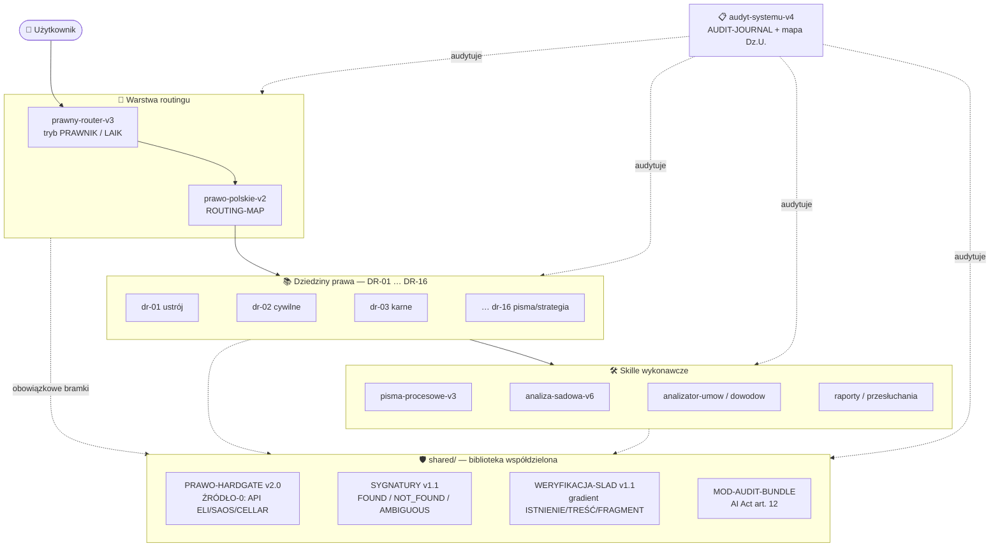

<div align="center">

# ⚖️ Lex Machina

**Modułowy system skilli prawniczych AI dla prawa polskiego — z twardymi bramkami antyhalucynacyjnymi**

[](LICENSE)
[](#-wersjonowanie)
[](#-wersjonowanie)
[](#-katalog-skilli)
[](#-kompatybilno%C5%9B%C4%87-llm)
[](#)

*System pokrywa 16 dziedzin prawa polskiego i unijnego: od routingu sprawy, przez analizę
dowodów i strategię procesową, po generowanie pism — z obowiązkową weryfikacją online
każdego przepisu i każdej sygnatury.*

[Szybki start](#-szybki-start) •
[Architektura](#%EF%B8%8F-architektura) •
[Kompatybilność LLM](#-kompatybilno%C5%9B%C4%87-llm) •
[Katalog skilli](#-katalog-skilli) •
[Mechanizmy weryfikacji](#%EF%B8%8F-mechanizmy-antyhalucynacyjne) •
[Baza źródeł](#baza-źródeł-i-portali) •
[Instalacja](#-instalacja) •
[Zadania cykliczne (Cowork)](#zadania-cykliczne-scheduled-tasks-w-cowork) •
[Zastrzeżenia](#%EF%B8%8F-zastrzeżenia-prawne)

</div>

---

## 🎯 Czym jest Lex Machina

Lex Machina to zestaw **33 skilli** (Claude AI Skills) tworzących kompletny warsztat pracy
z polskim prawem:

| | |
|---|---|
| 🧭 **Orkiestracja** | router spraw z trybami **PRAWNIK / LAIK**, macierz aktywacji, checkpointy jakości |
| 📚 **Wiedza dziedzinowa** | 16 modułów DR — każda dziedzina prawa PL/UE, jeden moduł = jeden akt prawny |
| 🛠️ **Narzędzia wykonawcze** | pisma procesowe, analiza umów i dowodów, przesłuchania świadków, chronologia, raporty |
| 🛡️ **Antyhalucynacja** | HARD GATE: zakaz cytowania prawa z pamięci, deterministyczne API, gradient weryfikacji cytatu |
| 📋 **Governance** | dziennik audytów, mapa Dz.U., paczka audytowa AI Act art. 12, polityka deduplikacji |
| 🔌 **Wieloplatformowość** | host-neutralny adapter runtime: Claude, hosty zgodne z OpenAI (ChatGPT / Codex / API / Atlas) **oraz** Grok (pobiera skille wprost z repozytorium) — te same bramki, bez przepisywania metodologii |

> **Zasada naczelna:** *brak numeru artykułu jest lepszy niż błędny numer artykułu;
> brak sygnatury jest lepszy niż sygnatura nieweryfikowana lub fałszywa.*

---

## 🚀 Szybki start

1. Pobierz repozytorium (`Code → Download ZIP` lub `git clone`)
2. Wgraj skille do Claude AI w kolejności: `shared/` → routing → DR → wykonawcze ([pełna instrukcja](#-instalacja))
3. Ustaw **User Preferences** w Claude AI:
   ```
   Prawo PL: router→v3 pierwszy, ISAP każdy przepis, HYBRID-VAL przed .docx. Karne: +kwalifikator.
   ```
4. Otwórz nową rozmowę i napisz: **„Mam sprawę prawną. Od czego zacząć?"**

---

## 🏗️ Architektura


```mermaid
flowchart TB
    U([👤 Użytkownik]) --> R

    subgraph ROUTING["🧭 Warstwa routingu"]
        R[prawny-router-v3<br/>tryb PRAWNIK / LAIK] --> PP[prawo-polskie-v2<br/>ROUTING-MAP]
    end

    subgraph DR["📚 Dziedziny prawa — DR-01 … DR-16"]
        D1[dr-01 ustrój] ~~~ D2[dr-02 cywilne] ~~~ D3[dr-03 karne] ~~~ DN[… dr-16 pisma/strategia]
    end

    subgraph EXEC["🛠️ Skille wykonawcze"]
        E1[pisma-procesowe-v3] ~~~ E2[analiza-sadowa-v6] ~~~ E3[analizator-umow / dowodow] ~~~ E4[raporty / przesłuchania]
    end

    subgraph SHARED["🛡️ shared/ — biblioteka współdzielona"]
        S1[PRAWO-HARDGATE v2.0<br/>ŹRÓDŁO-0: API ELI/SAOS/CELLAR] ~~~ S2[SYGNATURY v1.1<br/>FOUND / NOT_FOUND / AMBIGUOUS] ~~~ S3[WERYFIKACJA-SLAD v1.1<br/>gradient ISTNIENIE/TREŚĆ/FRAGMENT] ~~~ S4[MOD-AUDIT-BUNDLE<br/>AI Act art. 12]
    end

    AUD[📋 audyt-systemu-v4<br/>AUDIT-JOURNAL + mapa Dz.U.]

    PP --> DR
    DR --> EXEC
    ROUTING -.obowiązkowe bramki.-> SHARED
    DR -.-> SHARED
    EXEC -.-> SHARED
    AUD -. audytuje .-> ROUTING & DR & EXEC & SHARED
```

**Przepływ sprawy:** router klasyfikuje sprawę i tryb → ładuje właściwe moduły DR (lazy
loading: jeden moduł = jeden akt prawny) → skill wykonawczy realizuje zadanie → każde
powołanie przepisu/orzeczenia przechodzi przez bramki `shared/` → wynik z widocznym
śladem weryfikacji.

---

## 🔌 Kompatybilność LLM

Wersja rozwojowa jest **host-neutralna**: ten sam zestaw skilli działa na Claude,
na hostach zgodnych z OpenAI (**ChatGPT, Codex, API, Atlas**) oraz na **Grok**, bez
przepisywania metodologii, HARD GATE ani bramek jakości. Skille to zwykły Markdown
czytany pod wspólnym adapterem, więc nazwy operacji odziedziczone z jednego runtime
są traktowane jako semantyka, nie jako wymóg konkretnego API danego dostawcy.

> **Grok — automatyczne pobranie z repozytorium.** Grokowi wystarczy **wskazać
> repozytorium** (URL GitHub) i **którą wersję** ma wziąć — rozwojową
> (`Wersja rozwojowa rozpakowana/`) albo stabilną
> (`Wersja stabilna rozpakowana 21.08.2026/`). Grok pobiera i instaluje skille
> samodzielnie, bez ręcznego wgrywania folderów. Reguły sterujące (odpowiednik
> User Preferences) wskazujesz w jego instrukcjach/personalizacji tak samo jak na
> pozostałych hostach — patrz [Instalacja](#-instalacja).

**Warstwa portowalności** (nowość wersji rozwojowej — w wersji stabilnej jej nie ma):

| Element | Lokalizacja | Rola |
|---|---|---|
| Adapter runtime | [`shared/UNIVERSAL-RUNTIME-ADAPTER.md`](Wersja%20rozwojowa%20rozpakowana/shared/UNIVERSAL-RUNTIME-ADAPTER.md) | Jeden kontrakt wykonawczy: mapuje operacje zależne od hosta (`view`, `web_search`, `web_fetch`, `create_file`, `show_widget`) na natywne funkcje hosta lub ich odpowiedniki. |
| Manifest OpenAI | `<skill>/agents/openai.yaml` | Rejestracja skilla w ekosystemie OpenAI (`products: chatgpt, codex, api, atlas`) + `allow_implicit_invocation`. |
| Manifest integralności | `<skill>/PORTABILITY-MANIFEST.md` | Lista plików + SHA-256 — dowód, że przeniesienie między hostami jest bezstratne. |
| Pole `compatibility:` | frontmatter `SKILL.md` | Deklaruje wymagane operacje hosta (lub równoważne wg adaptera). |

**Zasady adaptera:**

- **Fail-closed** — jeżeli obowiązkowy zasób nie może zostać świeżo odczytany, skill
  zatrzymuje się; nie zastępuje go pamięcią modelu.
- **Bramki bez zmian** — `PRAWO-HARDGATE`, `TEMPORAL-LAW-CHECK`, `LEGAL-QUALITY-GATE`
  działają identycznie na każdym hoście. Brak natywnego generatora DOCX/PDF nie znosi
  walidacji — obniża jedynie format wyjścia do raportu strukturalnego.
- **Prywatność** — statyczne widgety i skrypty **nie wysyłają danych bezpośrednio** do
  żadnego dostawcy AI; wysyłka do zewnętrznego API tylko przez hosta i po jawnej decyzji
  użytkownika. Domyślna anonimizacja jest lokalna i deterministyczna.
- **Ścieżki** — zapis `shared/PLIK.md` oznacza kanoniczny zasób zainstalowanego skilla,
  a nie konkretny katalog systemowy; historyczne ścieżki `/mnt/...` są normalizowane do
  `skill/path`.

> **Zakres rolloutu (uczciwie):** warstwę niosą biblioteka `shared/` i skille
> instalowane przez router. Pojedyncze skille analityczne mogą jeszcze nie mieć
> własnego `agents/openai.yaml` — działają wtedy wywołane przez router, ale nie
> pojawiają się samodzielnie w katalogu skilli danego hosta OpenAI. Stan wdrożenia
> jest odnotowany w dzienniku audytów.

---

## 📁 Struktura repozytorium

```
Lex-Machina/
├── README.md                                ← ten plik
├── LICENSE                                  ← GNU GPL v3
├── DOKUMENTACJA-WDROZENIOWA-2026-07-13.md   ← dokumentacja wdrożeniowa systemu
├── claude_desktop_config.json               ← przykładowa konfiguracja konektorów MCP
├── WERSJA STABILNA 21.08.2026/              ← skille spakowane (.zip) — wersja stabilna
├── WERSJA ROZWOJOWA/                        ← skille spakowane (.zip) — wersja rozwojowa
├── Wersja stabilna rozpakowana 21.08.2026/  ← źródła skilli — wersja stabilna (Claude AI)
└── Wersja rozwojowa rozpakowana/            ← źródła skilli — tu trafiają bieżące zmiany
    ├── shared/                              ← bramki (PRAWO-HARDGATE, SYGNATURY,
    │   │                                      WERYFIKACJA-SLAD), UNIVERSAL-RUNTIME-ADAPTER,
    │   │                                      moduły MOD-*, definicje
    │   └── tools/                           ← skrypty audytowe + mcp-servers/ (przykłady
    │                                          konektorów: ISAP/ELI, SAOS, EUR-Lex, KRS…)
    │   (każdy skill: agents/openai.yaml + PORTABILITY-MANIFEST.md — warstwa host-neutralna)
    ├── prawny-router-v3/                    ← orkiestrator
    ├── prawo-polskie-v2/                    ← mapa routingu dziedzin
    ├── przewodnik-prawny-v2/                ← punkt wejścia dla laika
    ├── dr-01-… … dr-16-…/                   ← 16 dziedzin prawa
    ├── analiza-sadowa-v6/                   ┐
    ├── analizator-dowodow-v3/               │
    ├── analizator-przepisow-v2/             │
    ├── analizator-umow-v1/                  │
    ├── chronologia-sprawy-v1/               │
    ├── orzeczenia-sadowe-v2/                ├─ skille wykonawcze
    ├── pisma-procesowe-v3/                  │
    ├── pisma-proste-v2/                     │
    ├── przesluchanie-swiadkow-v2-min90/     │  (+ wariant -v35)
    ├── raport-klienta-v1/                   │
    ├── raport-sytuacyjny-v2/                ┘
    ├── *_build/                             ← katalogi robocze buildów — NIE wgrywać
    └── audyt-systemu-v4/                    ← governance: modules/, references/
                                               (AUDIT-JOURNAL, mapy Dz.U.), scripts/, widgets/
```

Katalog wersji stabilnej ma tę samą strukturę. Każdy skill to folder z `SKILL.md`
w korzeniu — do Claude AI wgrywa się cały folder skilla.

---

## 📚 Katalog skilli

### 🧭 Routing i orkiestracja

| Skill | Rola |
|---|---|
| `prawny-router-v3` | Punkt wejścia każdej sprawy: klasyfikacja [1]–[10], tryb PRAWNIK/LAIK, anonimizacja (KROK 0A), macierz aktywacji, step-tracker |
| `prawo-polskie-v2` | Mapa routingu: sprawa → właściwe skille DR |
| `przewodnik-prawny-v2` | Punkt wejścia dla laika — prowadzenie za rękę |

### ⚖️ Dziedziny prawa (DR-01 … DR-16)

| # | Skill | Zakres |
|---|---|---|
| 01 | `dr-01-ustroj-konstytucyjny-i-zrodla-prawa` | Konstytucja, źródła prawa, TK |
| 02 | `dr-02-prawo-cywilne-rodzinne-gospodarcze` | KC, KRO, KSH, KPC |
| 03 | `dr-03-prawo-karne-wykroczenia-egzekucja` | KK, KPK, KW, KKW |
| 04 | `dr-04-prawo-pracy-zus-swiadczenia` | KP, ZUS, świadczenia |
| 05 | `dr-05-prawo-administracyjne-sadowoadministracyjne` | KPA, PPSA |
| 06 | `dr-06-podatki-finanse-publiczne-aml` | Ordynacja, VAT/PIT/CIT, AML |
| 07 | `dr-07-zamowienia-publiczne-fundusze-ue` | PZP, KIO, fundusze UE |
| 08 | `dr-08-samorzad-terytorialny-prawo-lokalne` | JST, prawo miejscowe |
| 09 | `dr-09-budownictwo-srodowisko-energia-transport` | Prawo budowlane, OOŚ, energetyka |
| 10 | `dr-10-zdrowie-farmacja-zywnosc-rolnictwo` | Prawo medyczne, farmaceutyczne |
| 11 | `dr-11-cyfrowe-cyber-ai-dane-ip` | RODO (+ operacyjne: DPIA, DSAR, RCP/DPA, naruszenia 72h), AI Act, DSA/DMA, KSC/NIS2, IP |
| 12 | `dr-12-sadownictwo-prokuratura-zawody-prawnicze` | Ustrój sądów, zawody prawnicze |
| 13 | `dr-13-sluzby-bezpieczenstwo-informacje-niejawne` | Służby, informacje niejawne |
| 14 | `dr-14-prawo-ue-miedzynarodowe-prawa-czlowieka` | Prawo UE, EKPC, KPP |
| 15 | `dr-15-compliance-iso-governance-audyt` | Compliance, ISO, sygnaliści |
| 16 | `dr-16-pisma-strategia-dowody-orzecznictwo` | Warsztat procesowy przekrojowy |

### 🛠️ Skille wykonawcze

| Skill | Zastosowanie |
|---|---|
| `pisma-procesowe-v3` | Pozwy, apelacje, odpowiedzi na pozew — z bramkami DRAFT/FINAL |
| `pisma-proste-v2` | Sprzeciwy, wezwania do zapłaty, wnioski o klauzulę |
| `analizator-umow-v1` | Analiza i redakcja umów (w tym RODO: powierzenie, regulaminy) |
| `analizator-dowodow-v3` | Klasyfikacja, scoring i walidacja dowodów |
| `analizator-przepisow-v2` | Analiza przepisów, vacatio legis, historia nowelizacji |
| `orzeczenia-sadowe-v2` | Wyszukiwanie i weryfikacja orzecznictwa |
| `analiza-sadowa-v6` | Pełna, wieloprzebiegowa analiza sprawy (ekstrakcja → struktura → predykcja) |
| `chronologia-sprawy-v1` | Oś czasu zdarzeń prawnych |
| `przesluchanie-swiadkow-v2` | Pytania do świadków, kontrprzesłuchanie (≥90 pytań) |
| `raport-sytuacyjny-v2` | Interaktywny raport ryzyk (tryby IND/BIZ) |
| `raport-klienta-v1` | Raport statusu sprawy dla klienta końcowego |

### 📋 Governance

| Skill | Rola |
|---|---|
| `audyt-systemu-v4` | Audyt jakości i aktualności: [dziennik audytów](Wersja%20rozwojowa%20rozpakowana/audyt-systemu-v4/references/AUDIT-JOURNAL.md), mapy Dz.U., deduplikacja |

#### Przejrzystość stanu systemu — co czytać (a czego nie)

Dziennik audytów to pełny ślad forensyczny (ponad 950 sesji, dowody reprodukcji —
materiał dla audytora i pod AI Act art. 12), **nie** codzienna lektura. Aby poznać
aktualny stan i granice systemu, użytkownik ma trzy zwięzłe punkty wejścia:

| Artefakt | Plik | Co daje |
|---|---|---|
| 🚦 Tablica otwartych flag | [`references/WARN-OTWARTE.md`](Wersja%20rozwojowa%20rozpakowana/audyt-systemu-v4/references/WARN-OTWARTE.md) | „Co jeszcze do zrobienia" w jednym miejscu — tablica sterująca z podziałem flag (wykonalne sesją audytową / reaktywne / zależne od środowiska). Czytaj to zamiast całego dziennika. |
| 📊 Raporty pokrycia | [`references/raporty-pokrycia-2026-08-13/`](Wersja%20rozwojowa%20rozpakowana/audyt-systemu-v4/references/raporty-pokrycia-2026-08-13/) | Pokrycie per kodeks (🟢 pełne · 🟡 częściowe · 🔴 śladowe) + priorytety uzupełnień — od razu widać, co system pokrywa dobrze, a co śladowo. |
| 🗺️ Mapa Dz.U. | `references/mapa_dzu_*.md` (najnowsza: `2026-08-26`) | Data „zdjęcia" stanu prawnego — do czego numery Dz.U. są aktualne. |

> **Znane granice pokrycia (na dzień ostatniego audytu):** m.in. KKW (moduł istnieje,
> ale bez treści artykułów KKW), PPSA (brak dedykowanego modułu — rozproszone cytaty),
> SUS rozdz. 2 (zasady podlegania ubezpieczeniom), Układ w Prawie restrukturyzacyjnym.
> Pełna lista i priorytety: indeks raportów pokrycia. System **uczciwie odnotowuje**
> luki, zamiast je maskować — zgodnie z zasadą naczelną.

---

## 🛡️ Mechanizmy antyhalucynacyjne

Fundament systemu — pliki w `shared/`, obowiązkowe dla wszystkich skilli:

### ⛔ PRAWO-HARDGATE v2.0 — zakaz cytowania prawa z pamięci
Żaden przepis, numer Dz.U., stawka, termin ani sygnatura nie może paść bez weryfikacji
online **w tym samym kroku**. Hierarchia źródeł (od najsilniejszego):

```
POZIOM A  🔌 konektory MCP (verify_article, verify_signature — gdy skonfigurowane)
POZIOM B  🌐 strukturalne API:  api.sejm.gov.pl/eli (akty + łańcuch t.j.)
                                saos.org.pl/api (sygnatury) · EUR-Lex/CELEX (UE)
POZIOM C  🔍 web_search / web_fetch — wyłącznie fallback
```

Zawsze najnowszy tekst jednolity (deterministycznie przez endpoint ELI `/references`),
weryfikacja przedmiotu aktu (tytuł vs teza), specjalny reżim dla wyroków TK 2024–2026.

### 🔏 SYGNATURY v1.1 — kontrakt wyniku weryfikacji
Każda weryfikacja sygnatury kończy się jednym z czterech statusów — bez zgadywania:

| Status | Reakcja |
|---|---|
| 🟢 `FOUND` | dokładnie jedno trafienie → cytuj z pełnymi danymi |
| 🔴 `NOT_FOUND` | zero trafień w pokrytym zakresie → **nie cytuj** |
| 🟡 `AMBIGUOUS` | ta sama sygnatura w ≥2 sądach → przedstaw kandydatów, nie wybieraj |
| ⚪ `OUT_OF_SCOPE` | baza nie pokrywa sądu/okresu → eskaluj do bazy oficjalnej |

### 🎚️ WERYFIKACJA-SLAD v1.1 — gradient weryfikacji cytatu
Poziom weryfikacji musi odpowiadać sile twierdzenia — zamyka lukę
*„prawdziwy cytat, fałszywa teza"*:

```
ISTNIENIE  → samo powołanie kotwicy (sygnatura, nr Dz.U.)
TREŚĆ      → parafraza („SN przyjął, że…")
FRAGMENT   → cytat dosłowny / pinpoint
```
+ guard STRON (sygnatura realna doczepiona do innej sprawy = 🔴 blokada)
+ reguła kalibracji (twierdzisz FRAGMENT, osiągasz TREŚĆ → 🟠 złagodź tezę)
+ widoczny ślad weryfikacji w każdej odpowiedzi (`✅ [VER: źródło, data]`).

### 📦 MOD-AUDIT-BUNDLE — artefakt zgodności AI Act art. 12
Paczka audytowa deliverable: manifest JSON, sumy SHA-256, metadane (model, tryb,
źródła, zatwierdzający), jawne statusy `MISSING`. Dowód dla audytora i compliance —
nigdy załącznik do pisma.

---

## Baza źródeł i portali

Lex Machina nie przeszukuje internetu "na ślepo" — każde wyszukiwanie trafia do
skatalogowanej bazy źródeł o przypisanym rzędzie wiarygodności. Rejestry kanoniczne:
[`shared/HIERARCHIA-ZRODEL.md`](Wersja%20rozwojowa%20rozpakowana/shared/HIERARCHIA-ZRODEL.md)
(kategoryzacja wiarygodności Rząd 1 / 2A / 2B / 3) oraz
[`shared/PORTALE-BRANZOWE-RZAD-2B.md`](Wersja%20rozwojowa%20rozpakowana/shared/PORTALE-BRANZOWE-RZAD-2B.md)
(mapa portali per dziedzina DR, z empirycznymi testami `site:`, wersja 2.1).

> **Integracja jako źródła wyszukiwania (router v3.17, 2026-07-21):** oba rejestry
> istniały wcześniej, ale nie były ładowane przez żaden skill. Teraz
> `HIERARCHIA-ZRODEL.md` i `PORTALE-BRANZOWE-RZAD-2B.md` są w `required_modules`
> orkiestratora [`prawny-router-v3`](Wersja%20rozwojowa%20rozpakowana/prawny-router-v3/SKILL.md),
> więc każda sprawa prowadzona przez router — a przez to każdy uruchamiany przez
> niego skill DR — ma dostęp do kategoryzacji wiarygodności i mapy portali branżowych.

### Rząd 1 — źródła urzędowe (wyłączne dla brzmienia przepisu)

| Baza | Zakres |
|---|---|
| [isap.sejm.gov.pl](https://isap.sejm.gov.pl) + [api.sejm.gov.pl/eli](https://api.sejm.gov.pl/eli) | Dz.U. i M.P. od 1918 r. — teksty jednolite, łańcuch nowelizacji (deterministyczne API ELI) |
| [sejm.gov.pl](https://www.sejm.gov.pl) | proces legislacyjny |
| [eur-lex.europa.eu](https://eur-lex.europa.eu) | prawo UE (CELLAR/CELEX) |
| [dzienniki.gov.pl](https://dzienniki.gov.pl) | dzienniki urzędowe (m.in. wojewódzkie — prawo miejscowe) |
| [prawakonsumenta.uokik.gov.pl](https://prawakonsumenta.uokik.gov.pl) | UOKiK — prawa konsumenta, gotowe wzory pism (odstąpienie, reklamacja), polubowne spory (DR-02) |
| [parp.gov.pl](https://www.parp.gov.pl) | PARP — dotacje i dofinansowania dla firm, aktualne nabory (DR-06) |
| uodo.gov.pl, BIP właściwych organów | rozporządzenia branżowe, ochrona danych |

### Rząd 2A — oficjalne orzecznictwo i interpretacje

| Baza | Zakres |
|---|---|
| [sn.pl](https://sn.pl) | Sąd Najwyższy |
| [orzeczenia.ms.gov.pl](https://orzeczenia.ms.gov.pl) | Portal Orzeczeń Sądów Powszechnych + portale poszczególnych SA/SO/SR |
| [orzeczenia.nsa.gov.pl](https://orzeczenia.nsa.gov.pl) | CBOSA — NSA i 16 WSA |
| [trybunal.gov.pl](https://trybunal.gov.pl) + otkzu.trybunal.gov.pl | Trybunał Konstytucyjny (OTK ZU) |
| [orzeczenia.uzp.gov.pl](https://orzeczenia.uzp.gov.pl) | Krajowa Izba Odwoławcza |
| [saos.org.pl](https://www.saos.org.pl) | SAOS — wyszukiwarka pomocnicza i API weryfikacji sygnatur |
| [curia.europa.eu](https://curia.europa.eu), [echr.coe.int](https://www.echr.coe.int) | TSUE, ETPC |
| interpretacje.podatki.gov.pl (Eureka), zus.pl, pip.gov.pl, uokik.gov.pl, uzp.gov.pl i in. | interpretacje urzędowe per dziedzina — rejestr: [`shared/INTERPRETACJE-URZEDOWE.md`](Wersja%20rozwojowa%20rozpakowana/shared/INTERPRETACJE-URZEDOWE.md) |

### Rząd 2B — uznane portale prawnicze i branżowe (komentarz i kontekst)

Nigdy nie służą jako brzmienie przepisu ani dowód istnienia orzeczenia — zawsze ze
znacznikiem źródła pomocniczego.

| Kategoria | Portale |
|---|---|
| Generalistyczne | prawo.pl, infor.pl (+ kadry / ksiegowosc / samorzad), gofin.pl (+ subdomeny), gazetaprawna.pl, rp.pl, lexlege.pl, arslege.pl, money.pl |
| Gospodarcze i NGO (DR-02) | poradnikprzedsiebiorcy.pl, bankier.pl, ngo.pl (fundacje, stowarzyszenia — nowa nisza) |
| Podatki i księgowość (DR-06) | gofin.pl, ksiegowosc.infor.pl, podatki.biz, epodatnik.pl (archiwum interpretacji KIS), bankier.pl (proces legislacyjny), egospodarka.pl |
| Prawo pracy (DR-04) | kodekspracy.pl, kadry.infor.pl |
| Zamówienia publiczne (DR-07) | portalzp.pl |
| Samorząd (DR-08) | samorzad.infor.pl, prawodlasamorzadu.pl |
| Budownictwo (DR-09) | muratorplus.pl, prawniknabudowie.com, prawnikpodpowienabudowie.pl |
| Zdrowie, farmacja, rolnictwo (DR-10) | rynekzdrowia.pl (zdrowie/farmacja), farmer.pl, wiescirolnicze.pl (rolnictwo — ARiMR, KRUS) |
| RODO i cyfrowe (DR-11) | poradyodo.pl |
| Zawody prawnicze (DR-12) | palestra.pl, temidium.pl |
| Osoby z niepełnosprawnościami | niepelnosprawni.pl, integracja.org (+ popon.pl, obpon.org — perspektywa pracodawcy) |
| Bazy komercyjne (przy licencji) | LEX (sip.lex.pl), Legalis (sip.legalis.pl) — jako tekst przepisu Rząd 2A, jako komentarz Rząd 2B |

> Portale oznaczone jako AI-wspomagane (np. egospodarka.pl — część artykułów
> generowana przez AI) system traktuje z podwyższoną ostrożnością i krzyżuje z
> innym źródłem przy kluczowych ustaleniach.

Rejestr uczciwie odnotowuje dziedziny bez dominującego portalu branżowego (DR-03
karne, DR-05 administracyjne, DR-15 compliance) — tam system korzysta z portali
generalistycznych z zawężonym zapytaniem.

### Rząd 3 — strony kancelarii, blogi, NGO

Dopuszczone wyłącznie jako trop do dalszej weryfikacji — wysokie ryzyko
dezaktualizacji, obowiązkowe skrzyżowanie z Rzędem 1/2A przed użyciem.

### Konektory MCP (dostęp deterministyczny, poziom A)

| Konektor | Źródło | Status |
|---|---|---|
| `mcp-isap` | api.sejm.gov.pl/eli — 96 000+ aktów Dz.U./M.P. | skonfigurowany ([`claude_desktop_config.json`](claude_desktop_config.json)) |
| SAOS, EUR-Lex/CELLAR, KRS, CEIDG, NBP, SUDOP | przykładowe implementacje | [`shared/tools/mcp-servers/`](Wersja%20rozwojowa%20rozpakowana/shared/tools/mcp-servers/) + rekomendacje: [`shared/KONEKTORY-REKOMENDOWANE.md`](Wersja%20rozwojowa%20rozpakowana/shared/KONEKTORY-REKOMENDOWANE.md) |

---

## 💾 Instalacja

> **Wymagania:** konto [claude.ai](https://claude.ai) (skille wymagają planu płatnego) · przeglądarka — bez instalacji oprogramowania.
>
> **Inne hosty:** wersja rozwojowa jest host-neutralna (wspólny
> [adapter runtime](#-kompatybilno%C5%9B%C4%87-llm)). Kroki 1–4 opisują ścieżkę
> Claude AI; **Krok 5** — instalację w ChatGPT (hosty zgodne z OpenAI), a **Krok 6** —
> w Grok, który pobiera skille wprost z repozytorium po wskazaniu wersji. Na każdym
> hoście te same reguły trafiają do jego instrukcji/personalizacji, a bramki jakości
> są identyczne.

<details>
<summary><b>Krok 1 — Pobierz repozytorium</b></summary>

GitHub → zielony przycisk **Code** → **Download ZIP**, albo:

```bash
git clone https://github.com/michaleiatrak-star/Lex-Machina.git
```

Skille do wgrania znajdziesz w katalogu wersji (rozpakowanej lub jako pojedyncze
`.zip` w `WERSJA STABILNA …/`).
</details>

<details>
<summary><b>Krok 2 — Wgraj skille do Claude AI (kolejność ma znaczenie)</b></summary>

Claude AI → **Customize** → **Nowy skill** → **Wgraj skill z komputera** → wskaż **cały folder** skilla (nie pojedynczy plik `SKILL.md`).

Kolejność wgrywania:

| Etap | Skille | Status |
|---|---|---|
| 1️⃣ | `shared/` | obowiązkowy |
| 2️⃣ | `prawo-polskie-v2/`, `prawny-router-v3/` | obowiązkowe |
| 3️⃣ | `dr-01/` … `dr-16/` | wgraj wszystkie |
| 4️⃣ | skille wykonawcze | wg potrzeb (zalecany: `przewodnik-prawny-v2/`) |
| 5️⃣ | `audyt-systemu-v4/` | opcjonalny (administracja) |

**Minimalna instalacja:** `shared/` + `prawo-polskie-v2/` + `prawny-router-v3/` +
`przewodnik-prawny-v2/` + dowolny skill wykonawczy + DR-skille właściwe dla Twojej sprawy.
</details>

<details>
<summary><b>Krok 3 — User Preferences (kluczowy!)</b></summary>

Claude AI → ikona konta → **Settings** → **User Preferences** → wpisz dokładnie:

```
Prawo PL: router→v3 pierwszy, ISAP każdy przepis, HYBRID-VAL przed .docx. Karne: +kwalifikator.
```

| Fragment | Znaczenie |
|---|---|
| `router→v3 pierwszy` | router wczytywany jako pierwszy w każdej sprawie |
| `ISAP każdy przepis` | weryfikacja każdego przepisu w isap.sejm.gov.pl |
| `HYBRID-VAL przed .docx` | walidacja hybrydowa przed generowaniem Worda |
| `Karne: +kwalifikator` | w sprawach karnych moduł kwalifikatora karnomaterialnego |
</details>

<details>
<summary><b>Krok 4 — Weryfikacja i rozwiązywanie problemów</b></summary>

Test: nowa rozmowa → *„Mam sprawę prawną. Od czego zacząć?"* — system powinien
uruchomić router, dopytać o charakter sprawy i zaproponować przewodnik.

| Problem | Rozwiązanie |
|---|---|
| Claude nie używa routera | sprawdź User Preferences (dokładny tekst) i czy router jest na liście skilli |
| Skill nie pojawia się po wgraniu | wskaż **folder**, nie plik `SKILL.md` |
| Cytowanie bez weryfikacji | napisz: *„przypomnij sobie zasady HARDGATE"*; sprawdź czy `shared/` zawiera `PRAWO-HARDGATE.md` |
| Błąd „description too long" | uruchom: *„przeprowadź audyt systemu"* — wskaże winny skill |
</details>

<details>
<summary><b>Krok 5 — Instalacja w ChatGPT (host zgodny z OpenAI)</b></summary>

Wersja rozwojowa jest host-neutralna, więc w ChatGPT wgrywa się **te same foldery
skilli** i w **tej samej kolejności** co w Claude (patrz Krok 2). Każdy skill niesie
manifest `agents/openai.yaml` (`products: chatgpt, codex, api, atlas`) rozpoznawany
przez ekosystem OpenAI oraz wspólny [adapter runtime](#-kompatybilno%C5%9B%C4%87-llm),
który mapuje operacje systemu na natywne funkcje ChatGPT.

**Odpowiednikiem „User Preferences" (Krok 3) jest w ChatGPT pole instrukcji
niestandardowych w personalizacji** — te same reguły wpisujesz raz, dokładnie tak samo:

ChatGPT → **Ustawienia** → **Personalizacja** → **Instrukcje niestandardowe**
(*Custom instructions*) → pole *„Jak ChatGPT ma odpowiadać?"* (lub *„Co jeszcze ChatGPT
powinien wiedzieć?"*) → wklej:

```
Prawo PL: router→v3 pierwszy, ISAP każdy przepis, HYBRID-VAL przed .docx. Karne: +kwalifikator.
```

| Fragment | Znaczenie |
|---|---|
| `router→v3 pierwszy` | router wczytywany jako pierwszy w każdej sprawie |
| `ISAP każdy przepis` | weryfikacja każdego przepisu w isap.sejm.gov.pl |
| `HYBRID-VAL przed .docx` | walidacja hybrydowa przed generowaniem dokumentu |
| `Karne: +kwalifikator` | w sprawach karnych moduł kwalifikatora karnomaterialnego |

> Instrukcje niestandardowe działają globalnie na koncie — dokładnie jak User
> Preferences w Claude — więc reguły obowiązują w każdej nowej rozmowie bez
> powtarzania. Bramki jakości (HARD GATE, weryfikacja online, ZASADA 7) są identyczne.
> Gdy host nie ma natywnego generatora DOCX/PDF, system zwraca równoważny raport
> strukturalny — walidacja końcowa nie jest pomijana (patrz adapter runtime).
</details>

<details>
<summary><b>Krok 6 — Instalacja w Grok (automatyczne pobranie z repozytorium)</b></summary>

Grok nie wymaga ręcznego wgrywania folderów — potrafi **sam pobrać skille z
repozytorium**. Wystarczy:

1. **Wskaż repozytorium** — podaj Grokowi adres:
   `https://github.com/michaleiatrak-star/Lex-Machina`.
2. **Wskaż wersję** — którą gałąź/katalog ma wziąć:

   | Wersja | Katalog w repozytorium |
   |---|---|
   | 🟠 rozwojowa (host-neutralna) | `Wersja rozwojowa rozpakowana/` |
   | 🟢 stabilna (profil Claude) | `Wersja stabilna rozpakowana 21.08.2026/` |

3. Grok pobiera i instaluje skille automatycznie (zaczynając od `shared/`, potem
   router i skille DR — kolejność jak w Kroku 2).
4. **Reguły sterujące** wpisz w instrukcjach/personalizacji Grok — ta sama kanoniczna
   reguła co w Claude i ChatGPT:

   ```
   Prawo PL: router→v3 pierwszy, ISAP każdy przepis, HYBRID-VAL przed .docx. Karne: +kwalifikator.
   ```

> Bramki jakości (HARD GATE, weryfikacja online, ZASADA 7) obowiązują identycznie.
> Do brzmienia przepisu i sygnatur Grok korzysta z weryfikacji online zgodnie z
> adapterem runtime — nie cytuje prawa z pamięci.
</details>

---

## Zadania cykliczne (scheduled tasks) w Cowork

Cowork (aplikacja desktop Claude, plany płatne) pozwala uruchamiać skille systemu
automatycznie według harmonogramu — typowo cykliczny audyt `audyt-systemu-v4`
(monitoring nowych Dz.U., zamykanie flag WARN).

### Jak utworzyć zadanie

Uruchom audyt systemu w trybie graficznym w Cowork i wybierz automatyzację systemu - weryfikacje dzienników ustaw, system poprowadzi cię automatycznie.

### Prompt zadania dla Lex Machina — reguły

Zadanie startuje w **świeżej sesji**: prompt musi być samowystarczalny i **musi
precyzować zakres audytu**. Samo „przeprowadź audyt" uruchamia w `audyt-systemu-v4`
interaktywne menu wyboru (FAZA 0B), na które w sesji automatycznej nikt nie odpowie.
Wskazuj wprost tryb z sekcji „TRYBY WYWOŁANIA" w `audyt-systemu-v4/SKILL.md`:

| Cel | Częstotliwość | Prompt zadania |
|---|---|---|
| Monitoring nowych Dz.U. / t.j. | Daily / Weekdays | `Uruchom audyt-systemu-v4 w TRYBIE DZU: sprawdź mapę Dz.U., zaktualizuj tabelę MONITORING i AUDIT-JOURNAL.` |
| Pełny audyt systemu | Weekly | `Uruchom audyt-systemu-v4 w TRYBIE AUTO: pełny audyt, Fazy 0–7, bez menu interaktywnego.` |
| Zamykanie otwartych flag | Weekly | `Uruchom audyt-systemu-v4 w TRYBIE WARN-CLOSE: zamknij otwarte warningi z references/WARN-OTWARTE.md.` |

### O czym pamiętać

- Zadanie lokalne wykonuje się tylko przy otwartej aplikacji i niewyłączonym komputerze;
  pominięty termin → jeden przebieg nadrabiający po wybudzeniu. Zadania niezależne od
  komputera twórz jako zdalne *routines* (chmura Anthropic).
- Wynik każdego przebiegu pojawia się jako sesja w sekcji **Scheduled** — sprawdź, czy
  audyt zakończył się obowiązkowym wpisem w `AUDIT-JOURNAL.md` (FAZA 7).
- Wszystkie bramki systemu (HARDGATE, weryfikacja online, ZASADA 7) obowiązują również
  w sesjach automatycznych — skille `shared/` i `audyt-systemu-v4/` muszą być wgrane
  na koncie, na którym działa Cowork.

---

## 🔄 Wersjonowanie

| Kanał | Lokalizacja | Przeznaczenie |
|---|---|---|
| 🟢 **Stabilna** | `WERSJA STABILNA 21.08.2026/` + katalog rozpakowany | do codziennej pracy — profil **Claude AI** |
| 🟠 **Rozwojowa** | `WERSJA ROZWOJOWA/` + `Wersja rozwojowa rozpakowana/` | nowe mechanizmy przed promocją; dochodzi warstwa **host-neutralna** (Claude + ChatGPT/Codex/API/Atlas + Grok) |

Każda zmiana w systemie jest odnotowana w
[**dzienniku audytów**](Wersja%20rozwojowa%20rozpakowana/audyt-systemu-v4/references/AUDIT-JOURNAL.md)
(`audyt-systemu-v4/references/AUDIT-JOURNAL.md`) — format: jedna sekcja
`## AUDYT-YYYY-MM-DD` na sesję, z tabelą zmienionych plików, naprawami
i otwartymi flagami. Bieżący zakres „do zrobienia" (bez przekopywania całego
dziennika) trzyma [`references/WARN-OTWARTE.md`](Wersja%20rozwojowa%20rozpakowana/audyt-systemu-v4/references/WARN-OTWARTE.md).
Aktualność numerów Dz.U. pilnowana jest w centralnej
mapie (`audyt-systemu-v4/references/mapa_dzu_*.md`).

---

## ⚠️ Zastrzeżenia prawne

> **Lex Machina dostarcza informację prawną, nie poradę prawną.**
>
> - System jest narzędziem wspomagającym — **nie zastępuje adwokata ani radcy prawnego**; w sprawach o istotnej wadze skonsultuj się z profesjonalnym pełnomocnikiem.
> - Mimo wielowarstwowych bramek weryfikacyjnych każdy przepis i każdą sygnaturę **zweryfikuj samodzielnie** w źródłach oficjalnych (isap.sejm.gov.pl, sn.pl, orzeczenia.ms.gov.pl) przed użyciem w postępowaniu.
> - Wygenerowane pisma mają status **DRAFT** do czasu ich świadomej akceptacji przez człowieka.
> - Stan prawny zmienia się stale — mapy aktów są „zdjęciem" na datę ostatniego audytu.

---

## 🤝 Kontakt i zgłaszanie błędów

Błędy, sugestie i propozycje zmian → [**Issues**](https://github.com/michaleiatrak-star/Lex-Machina/issues)

## 📜 Licencja

Projekt udostępniony na licencji **[GNU GPL v3](LICENSE)**.

<div align="center">
<sub>⚖️ Lex Machina — <i>prawo z maszyny, weryfikacja ze źródła.</i></sub>
</div>
